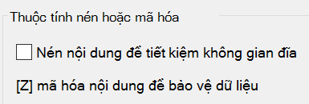

# Mã hóa tệp hoặc thư mục trong Windows 10

Bạn có thể mã hóa toàn bộ một đĩa bằng BitLocker, nhưng chỉ mã hóa các tệp hoặc thư mục riêng lẻ (và nội dung của chúng):

1. Trong **file Explorer**, chọn (các) tệp/thư mục bạn muốn mã hóa. Trong ví dụ này, hai tệp đã được chọn:

    

2. Bấm chuột phải vào tệp đã chọn và bấm **thuộc tính**.

3. Trong cửa sổ **thuộc tính** , bấm **nâng cao**.

4. Trong cửa sổ **thuộc tính nâng cao** , chọn hộp kiểm **mã hóa nội dung để bảo mật dữ liệu** :

    

5. Bấm **OK**.
