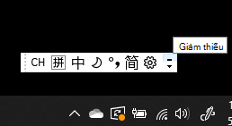

# Ẩn, Hiển thị hoặc đặt lại thanh ngôn ngữ

**Để giảm thiểu thanh ngôn ngữ:**

Bạn có thể nhấp vào nút thu nhỏ ở góc trên bên phải của thanh ngôn ngữ. Hoặc, bạn có thể chỉ cần kéo thanh ngôn ngữ vào thanh tác vụ, sẽ tự động thu nhỏ nó.

**Để bật thanh ngôn ngữ:**

Nếu bạn không muốn gắn thanh ngôn ngữ trong thanh tác vụ, hãy bấm chuột phải vào bất kỳ khoảng trống nào trong thanh tác vụ và bỏ chọn **thanh ngôn ngữ** trong menu thanh công cụ. Điều này sẽ làm cho thanh ngôn ngữ xuất hiện bên ngoài thanh tác vụ, giống như ảnh chụp màn hình trước đó.

**Để khôi phục thanh ngôn ngữ theo mặc định:**

Bấm chuột phải vào nút ngôn ngữ trên thanh công cụ và nhấp vào **khôi phục thanh ngôn ngữ** tùy chọn trong menu. Điều này sẽ khôi phục nó về mặc định.

