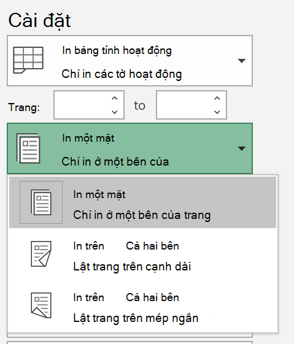

# In cả hai mặt giấy (in kép)

**Máy in của tôi có khả năng in hai mặt không?**

Tóm tắt tính năng của máy in hoặc hướng dẫn sử dụng sẽ cho bạn biết liệu có có khả năng in cả hai mặt của giấy, còn được gọi là "bản in kép". Nếu bạn có Microsoft Office, một cách khác để tìm hiểu là bằng cách mở một ứng dụng Office như Word hoặc Excel, đi đến **tệp > in**, đảm bảo máy in phải được chọn và tìm kiếm khả năng trong phần thiết đặt. Ví dụ: 

**In hai mặt trong Microsoft Office**

Nếu máy in của bạn có khả năng in cả hai mặt, khi bạn đi đến **tệp > in** trong ứng dụng Office, bạn sẽ thấy một tùy chọn "in trên cả hai mặt" như được hiển thị trong ví dụ ở trên.  Chọn loại in hai mặt bạn muốn (flip trên cạnh dài, hoặc lật trên cạnh ngắn), rồi bấm in để bắt đầu bản **in** .

**In kép từ bất kỳ ứng dụng nào**

Trong nhiều ứng dụng khi bạn in, bạn sẽ thấy một hộp thoại in chung trông như thế này: 

Hãy đảm bảo rằng máy in phải được chọn, rồi bấm vào **tùy chọn** để mở cửa sổ tùy chọn máy in. Nếu máy in có khả năng in hai mặt, khả năng kích hoạt điều này cho công việc in hiện tại sẽ hiển thị trong cửa sổ đó.
